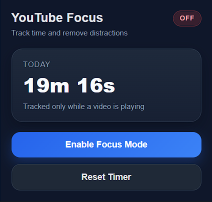
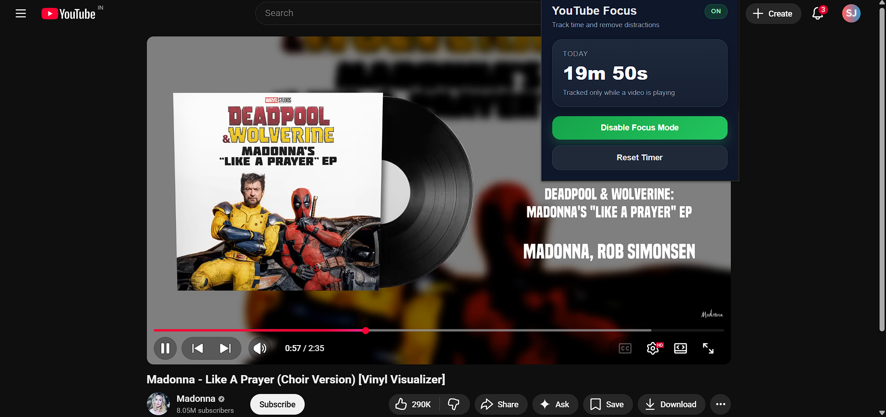
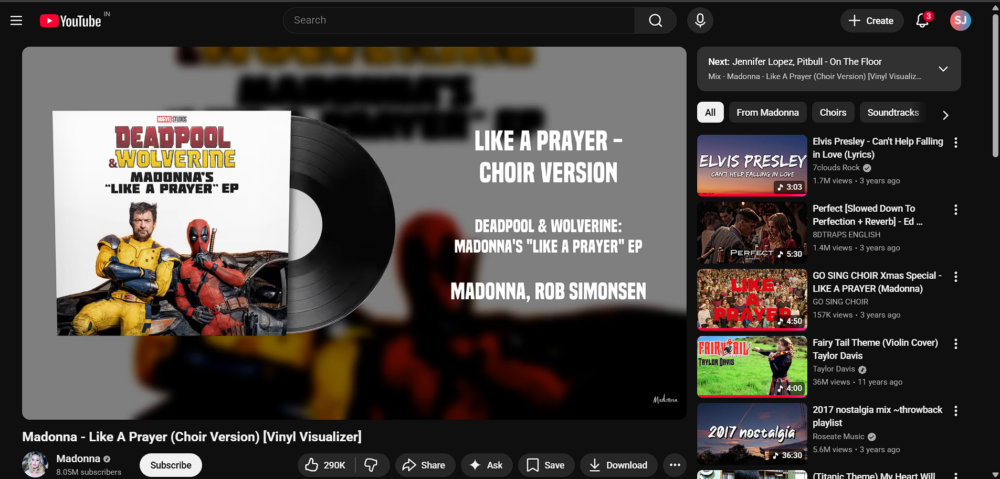

# YouTube Focus & Time Tracker

A Chrome extension that helps users stay productive on YouTube by tracking watch time only while videos are actually playing and by hiding distracting elements with Focus Mode.

## Features

- Tracks YouTube watch time while a video is actively playing
- Ignores paused, buffering, and ended states
- Focus Mode hides distracting sections like recommendations and comments
- Clean popup interface
- Reset timer support

## Tech Stack

- JavaScript
- Chrome Extension API
- Chrome Storage API
- Manifest V3

## Installation

1. Download or clone this repository
2. Open `chrome://extensions`
3. Enable **Developer Mode**
4. Click **Load unpacked**
5. Select the project folder

## Current Version

Version 1 includes:

- it has working watch timer
- buffering fix
- focus mode
- improved popup UI

## Future Improvements

- will do daily watch limit
- weekly statistics
- better icon set
- optional ad element hiding

## Screenshots

### Popup UI

### Focus Mode Enabled

### YouTube Home

## Project Goal

This project was built as a productivity-focused Chrome extension to help reduce distractions while using YouTube.
